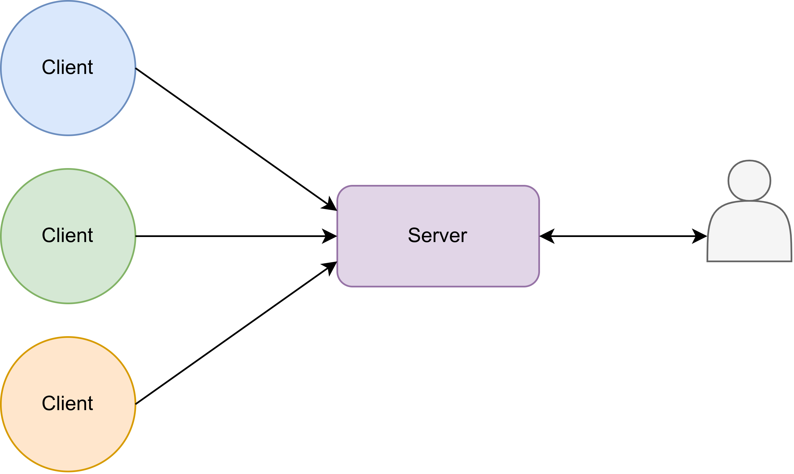

# watchcorgi

A simple multi-GPU server management tool.



# Pre-preparation

Make sure the monitoring server has `redis-server` installed that without password.

# Installation

Download the `watchcorgi-client` and `watchcorgi-server` programs separately, put the `watchcorgi-client` on the GPU server you want to monitor, and the `watchcorgi-server` on a monitoring server.

If you want to use `systemd` to deploy, please change the server address in the service file provided here.

# Usage

```bash
➜  ~ curl 127.0.0.1:7070/info
>> 2023-06-03 11:08:27 [AI Sec Lab]
+---------+------+------+-------------------------------------+------+-------------------+-------------+-----------+
|   name  |cpu[s]|cpu[u]|              gpu device             |gpu[u]|       gpu[m]      |   gpu user  |update time|
+---------+------+------+-------------------------------------+------+-------------------+-------------+-----------+
| chouniu | 0.0 %| 0.0 %|      A100-PCIE-40GB(460.106.00)     |  0 % |  0 MiB/40536 MiB  |     null    |  11:08:17 |
|         |      |      |      A100-PCIE-40GB(460.106.00)     | 17 % |  0 MiB/40536 MiB  |             |           |
+---------+------+------+-------------------------------------+------+-------------------+-------------+-----------+
|fenghuang| 0.0 %| 0.0 %|  NVIDIA GeForce RTX 3090(515.65.01) |  0 % |  2 MiB/24576 MiB  |wuxxxxxxxxxxx|  11:08:25 |
|         |      |      |  NVIDIA GeForce RTX 3090(515.65.01) | 91 % |12611 MiB/24576 MiB|             |           |
+---------+------+------+-------------------------------------+------+-------------------+-------------+-----------+
|   imp   | 0.0 %| 0.0 %|NVIDIA GeForce GTX 1080 Ti(530.30.02)|  0 % |  0 MiB/11264 MiB  |     null    |  11:08:16 |
|         |      |      |NVIDIA GeForce GTX 1080 Ti(530.30.02)|  1 % |  0 MiB/11264 MiB  |             |           |
+---------+------+------+-------------------------------------+------+-------------------+-------------+-----------+
| kunpeng | 0.0 %|11.1 %|                                     |      |                   |driver failed|  11:08:22 |
+---------+------+------+-------------------------------------+------+-------------------+-------------+-----------+
|  peppa  | 0.0 %| 0.3 %|NVIDIA GeForce RTX 2080 Ti(530.30.02)|  0 % |  0 MiB/11264 MiB  |     null    |  11:08:25 |
+---------+------+------+-------------------------------------+------+-------------------+-------------+-----------+
|   rick  | 0.3 %| 0.5 %|         Quadro P5000(510.54)        | 100 %|16145 MiB/16384 MiB|    jxxxx    |  11:08:27 |
+---------+------+------+-------------------------------------+------+-------------------+-------------+-----------+
| shiyuan | 4.7 %|13.4 %|      A100-PCIE-40GB(460.106.00)     |  0 % |39262 MiB/40536 MiB| huangdxxxxx |  11:08:26 |
|         |      |      |      A100-PCIE-40GB(460.106.00)     |  0 % |  3 MiB/40536 MiB  |             |           |
+---------+------+------+-------------------------------------+------+-------------------+-------------+-----------+
|  swift  | 0.0 %| 0.0 %|NVIDIA GeForce RTX 2080 Ti(510.47.03)|  0 % |  1 MiB/11264 MiB  |     null    |  11:08:24 |
|         |      |      |NVIDIA GeForce RTX 2080 Ti(510.47.03)|  0 % |  1 MiB/11264 MiB  |             |           |
+---------+------+------+-------------------------------------+------+-------------------+-------------+-----------+
|  xuanwu | 0.0 %| 0.0 %|  NVIDIA A100-PCIE-40GB(525.116.03)  | 91 % |18796 MiB/40960 MiB|   lixxxxxx  |  11:08:17 |
|         |      |      |                                     |      |                   |wuxxxxxxxxxxx|           |
+---------+------+------+-------------------------------------+------+-------------------+-------------+-----------+
|  yinhu  | 0.0 %| 0.0 %| NVIDIA GeForce RTX 3090(525.116.03) |  0 % |  0 MiB/24576 MiB  |     null    |  11:08:14 |
+---------+------+------+-------------------------------------+------+-------------------+-------------+-----------+
|  zhuque | 0.3 %| 2.5 %|   NVIDIA A100-PCIE-40GB(515.65.01)  |  0 % | 3671 MiB/40960 MiB| dingxxxxxxx |  11:08:27 |
+---------+------+------+-------------------------------------+------+-------------------+-------------+-----------+
|  zishu  | 0.2 %|17.7 %| NVIDIA GeForce RTX 4090(525.116.03) | 70 % | 2166 MiB/24564 MiB| dingxxxxxxx |  11:08:24 |
+---------+------+------+-------------------------------------+------+-------------------+-------------+-----------+
Powered by Rust
```